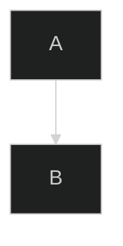

# General Mermaid Rules

## Version

Syntax documented here targets **Mermaid v11.15.0**. Beta diagram types (`*-beta`) may change without notice.

## Rendering Gotchas

### SVG ID Collisions

When rendering many diagrams on one page, Mermaid's timestamp-based ID generation produces **duplicate SVG IDs**, causing diagrams to overwrite each other silently.

**Root cause:** `mermaid.init()` called in a loop processes all unprocessed `.mermaid` divs on the first call, using `Date.now()` for IDs. Diagrams rendered within the same millisecond get identical IDs.

**Fix:**
```javascript
// Use mermaid.run() instead of mermaid.init() in a loop
mermaid.initialize({ startOnLoad: false, deterministicId: true });
await mermaid.run({ nodes: containers, suppressErrors: true });
```

**Never do this:**
```javascript
divs.forEach(div => mermaid.init(undefined, div)); // ID collisions!
```

### Per-Diagram `%%{init}%%` Directives

The `%%{init: {'deterministicId': true}}%%` directive inside a code block is **not processed** when using `mermaid.init()` directly. It only works with `mermaid.run()` or when Mermaid auto-renders from the DOM.

## Syntax Conventions

### Indentation

- Most diagrams ignore or normalize leading whitespace uniformly within code blocks
- **Exception:** Ishikawa and TreeView use indentation as structural syntax (parent-child)
- **Exception:** Mindmap uses indentation for hierarchy

### Quoting

- Unquoted identifiers: `A`, `Web App`, `my-service`
- Quoted identifiers required when name starts with non-letter or contains special chars: `"My Service"`, `"123abc"`
- Wardley component names with hyphens do NOT need quotes: `real-time processing`

### Blank Lines

Some diagrams (Event Modeling) require a **blank line** after the diagram keyword before content begins.

## Configuration

### Global Config

```javascript
mermaid.initialize({
  startOnLoad: false,
  deterministicId: true,  // Prevents ID collisions - ALWAYS use this
  securityLevel: 'loose',  // If you need click handlers
});
```

### Per-Diagram Config (in code block)

````

````

**Warning:** Per-diagram init directives are only processed by `mermaid.run()`, not `mermaid.init()`.
