<https://github.com/mermaid-js/mermaid>

# 1. Flowchart

## Basic Flowchart

```mermaid
flowchart TD
    Start([Start]) --> Process1[Write Code]
    Process1 --> Test{Tests Pass?}
    Test -- Yes --> Deploy[Deploy to Prod]
    Test -- No --> Process1
    Deploy --> End([End])
```

## Advanced Cloud Architecture (Flowchart)
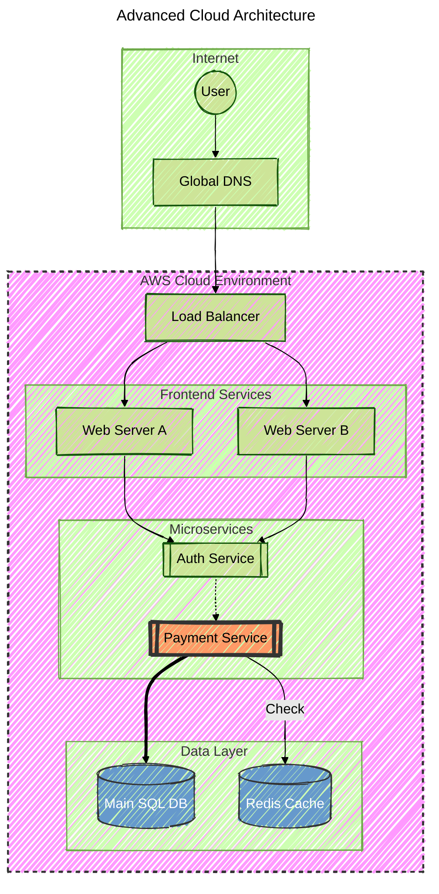
```mermaid
---
title: Advanced Cloud Architecture
config:
  theme: forest
  look: handDrawn
---
flowchart TB
    classDef cloud stroke:#333,stroke-width:2px,fill:#f9f,stroke-dasharray: 5 5
    classDef database fill:#69c,stroke:#333,color:#fff
    classDef critical fill:#f96,stroke:#333,stroke-width:4px

    subgraph Internet
        User((User))
        DNS[Global DNS]
    end

    subgraph AWS_Cloud ["AWS Cloud Environment"]
        LB[Load Balancer]
        
        subgraph Web_Tier ["Frontend Services"]
            direction LR
            Web1[Web Server A]
            Web2[Web Server B]
        end

        subgraph App_Tier ["Microservices"]
            Auth[[Auth Service]]
            Payment[[Payment Service]]
        end

        subgraph Data_Storage ["Data Layer"]
            SQL[(Main SQL DB)]
            Cache[(Redis Cache)]
        end
    end

    User --> DNS
    DNS --> LB
    LB --> Web1 & Web2
    Web1 & Web2 --> Auth
    Auth -.-> Payment
    Payment ==> SQL
    Payment -- "Check" --> Cache

    class AWS_Cloud cloud
    class SQL,Cache database
    class Payment critical
```

---

# 2. Sequence Diagram

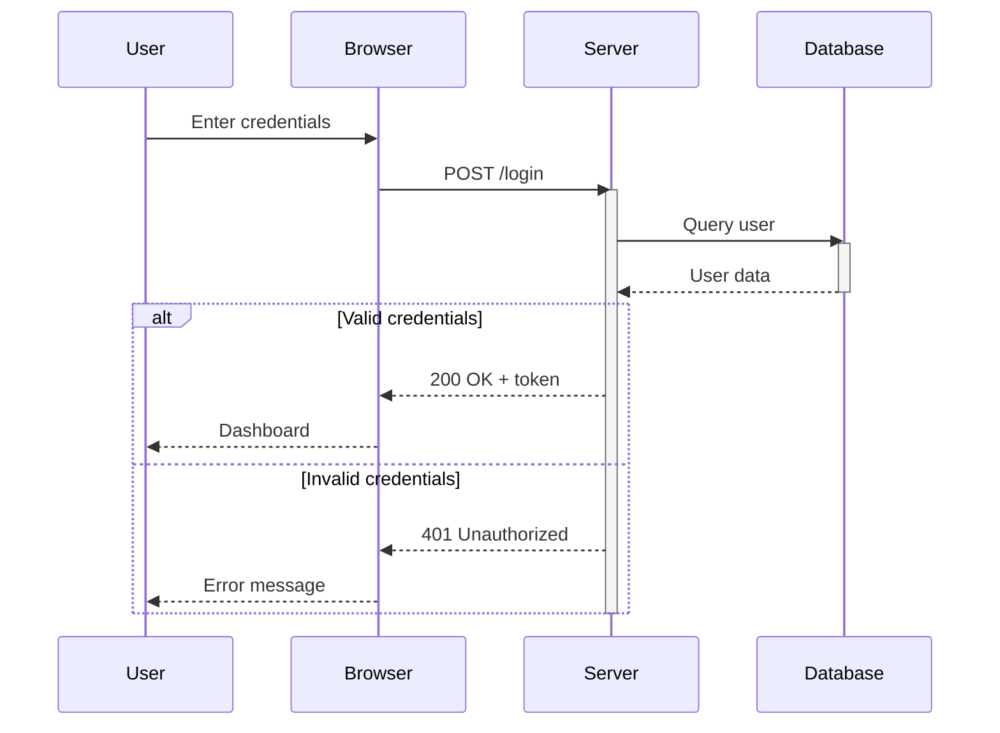
```mermaid
sequenceDiagram
    participant User
    participant Browser
    participant Server
    participant Database

    User->>Browser: Enter credentials
    Browser->>Server: POST /login
    activate Server
    Server->>Database: Query user
    activate Database
    Database-->>Server: User data
    deactivate Database
    alt Valid credentials
        Server-->>Browser: 200 OK + token
        Browser-->>User: Dashboard
    else Invalid credentials
        Server-->>Browser: 401 Unauthorized
        Browser-->>User: Error message
    end
    deactivate Server
```

---

# 3. Class Diagram

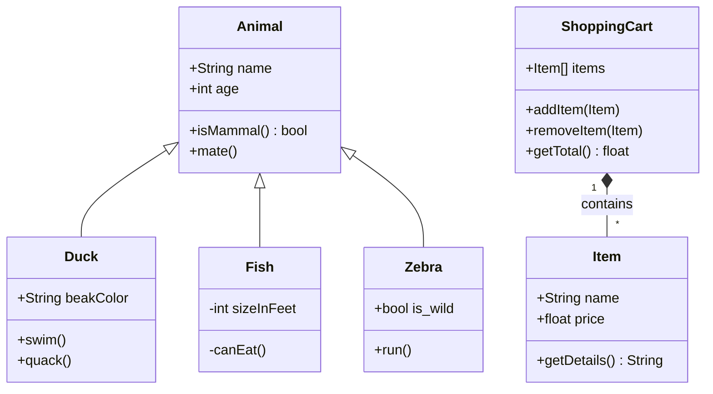
```mermaid
classDiagram
    class Animal {
        +String name
        +int age
        +isMammal() bool
        +mate()
    }
    class Duck {
        +String beakColor
        +swim()
        +quack()
    }
    class Fish {
        -int sizeInFeet
        -canEat()
    }
    class Zebra {
        +bool is_wild
        +run()
    }
    class ShoppingCart {
        +Item[] items
        +addItem(Item)
        +removeItem(Item)
        +getTotal() float
    }
    class Item {
        +String name
        +float price
        +getDetails() String
    }

    Animal <|-- Duck
    Animal <|-- Fish
    Animal <|-- Zebra
    ShoppingCart "1" *-- "*" Item : contains
```

---

# 4. State Diagram

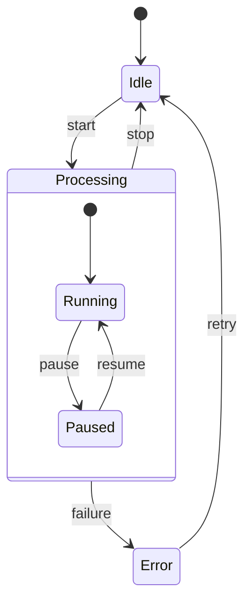
```mermaid
stateDiagram-v2
    [*] --> Idle
    Idle --> Processing : start
    Processing --> Idle : stop
    Processing --> Error : failure
    Error --> Idle : retry

    state Processing {
        [*] --> Running
        Running --> Paused : pause
        Paused --> Running : resume
    }
```

---

# 5. Entity Relationship Diagram

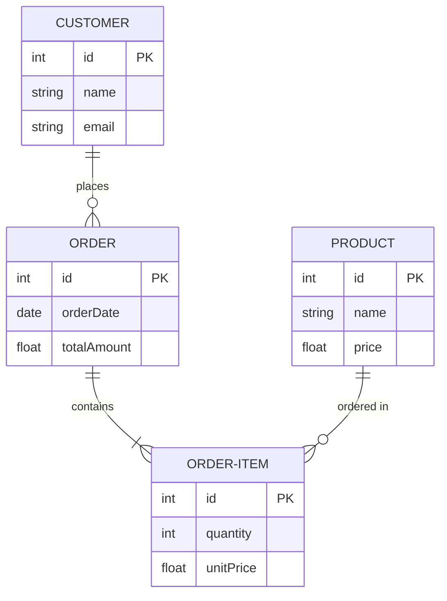
```mermaid
erDiagram
    CUSTOMER ||--o{ ORDER : places
    ORDER ||--|{ ORDER-ITEM : contains
    PRODUCT ||--o{ ORDER-ITEM : "ordered in"
    CUSTOMER {
        int id PK
        string name
        string email
    }
    ORDER {
        int id PK
        date orderDate
        float totalAmount
    }
    ORDER-ITEM {
        int id PK
        int quantity
        float unitPrice
    }
    PRODUCT {
        int id PK
        string name
        float price
    }
```

---

# 6. User Journey

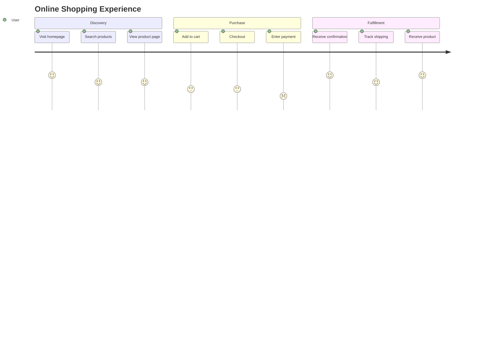
```mermaid
journey
    title Online Shopping Experience
    section Discovery
      Visit homepage: 5: User
      Search products: 4: User
      View product page: 4: User
    section Purchase
      Add to cart: 3: User
      Checkout: 3: User
      Enter payment: 2: User
    section Fulfillment
      Receive confirmation: 5: User
      Track shipping: 4: User
      Receive product: 5: User
```

---

# 7. Gantt Chart

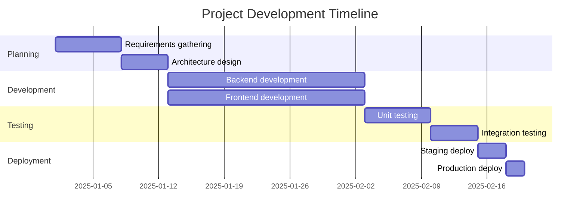
```mermaid
gantt
    title Project Development Timeline
    dateFormat YYYY-MM-DD
    section Planning
    Requirements gathering :a1, 2025-01-01, 7d
    Architecture design    :a2, after a1, 5d
    section Development
    Backend development    :b1, after a2, 21d
    Frontend development   :b2, after a2, 21d
    section Testing
    Unit testing           :c1, after b1, 7d
    Integration testing    :c2, after c1, 5d
    section Deployment
    Staging deploy         :d1, after c2, 3d
    Production deploy      :d2, after d1, 2d
```

---

# 8. Pie Chart

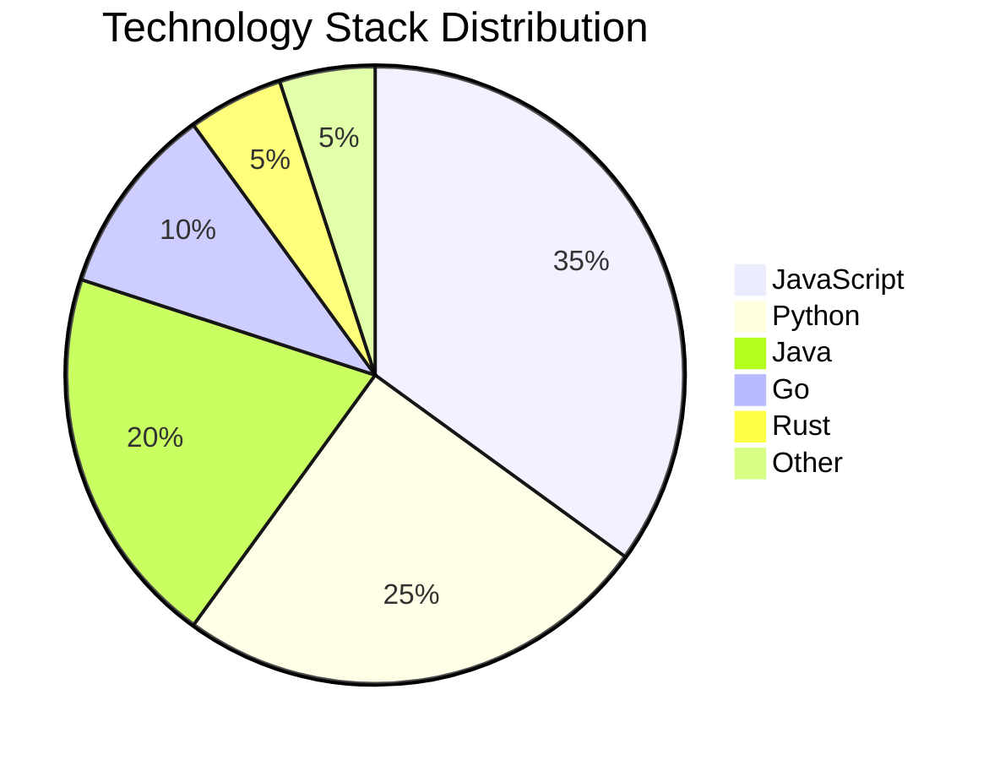
```mermaid
pie title Technology Stack Distribution
    "JavaScript" : 35
    "Python" : 25
    "Java" : 20
    "Go" : 10
    "Rust" : 5
    "Other" : 5
```

---

# 9. Quadrant Chart

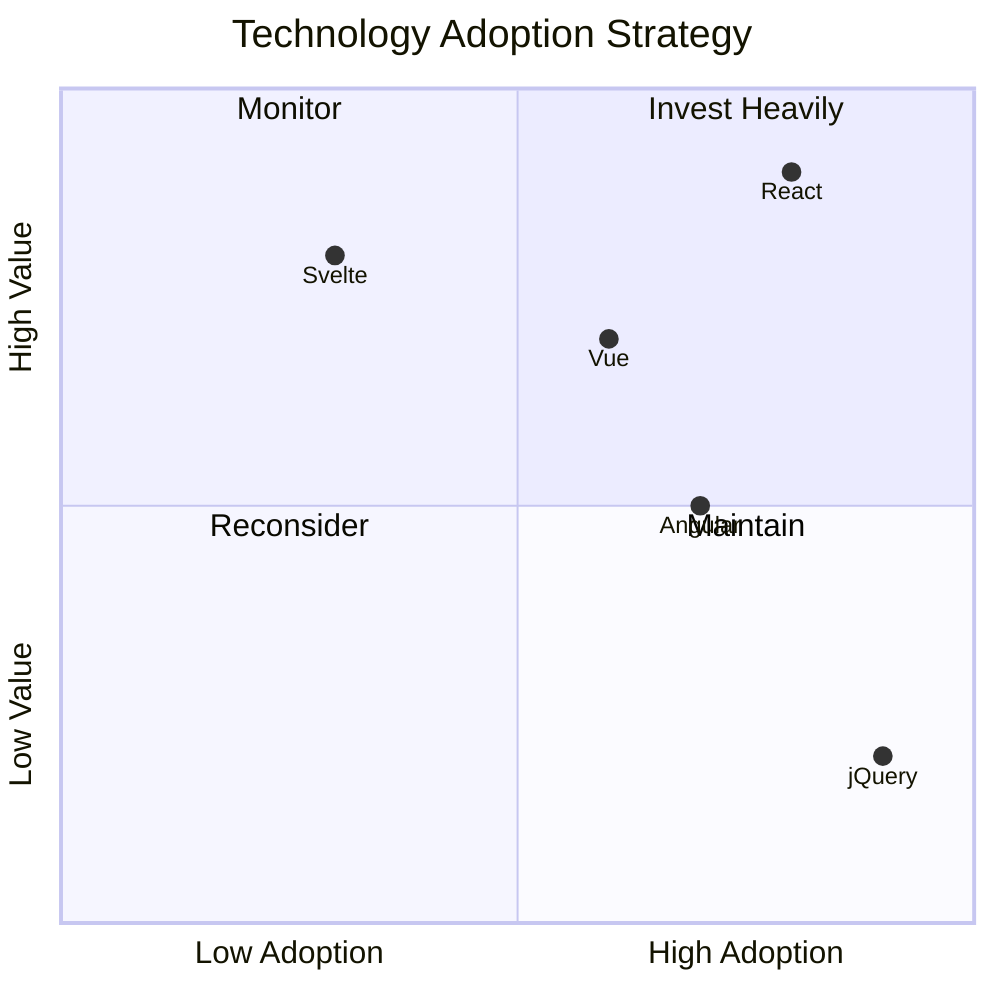
```mermaid
quadrantChart
    title Technology Adoption Strategy
    x-axis Low Adoption --> High Adoption
    y-axis Low Value --> High Value
    quadrant-1 Invest Heavily
    quadrant-2 Monitor
    quadrant-3 Reconsider
    quadrant-4 Maintain
    React: [0.8, 0.9]
    Vue: [0.6, 0.7]
    Svelte: [0.3, 0.8]
    Angular: [0.7, 0.5]
    jQuery: [0.9, 0.2]
```

---

# 10. Requirement Diagram

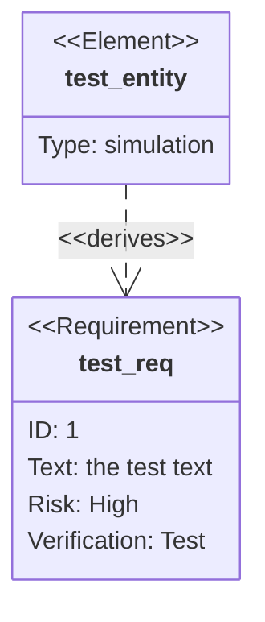
```mermaid
requirementDiagram
    requirement test_req {
        id: 1
        text: the test text
        risk: high
        verifymethod: test
    }
    element test_entity {
        type: simulation
    }
    test_entity - derives -> test_req
```

---

# 11. GitGraph Diagram

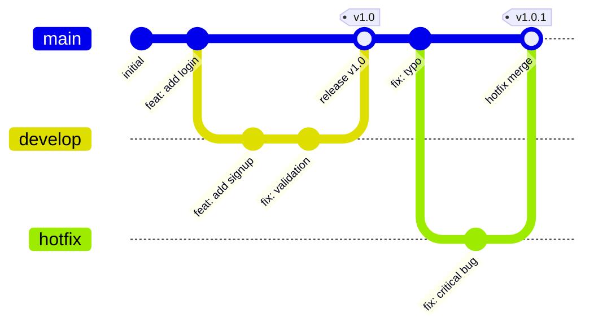
```mermaid
gitGraph
    commit id: "initial"
    commit id: "feat: add login"
    branch develop
    commit id: "feat: add signup"
    commit id: "fix: validation"
    checkout main
    merge develop id: "release v1.0" tag: "v1.0"
    commit id: "fix: typo"
    branch hotfix
    commit id: "fix: critical bug"
    checkout main
    merge hotfix id: "hotfix merge" tag: "v1.0.1"
```

---

# 12. C4 Diagram (System Context)

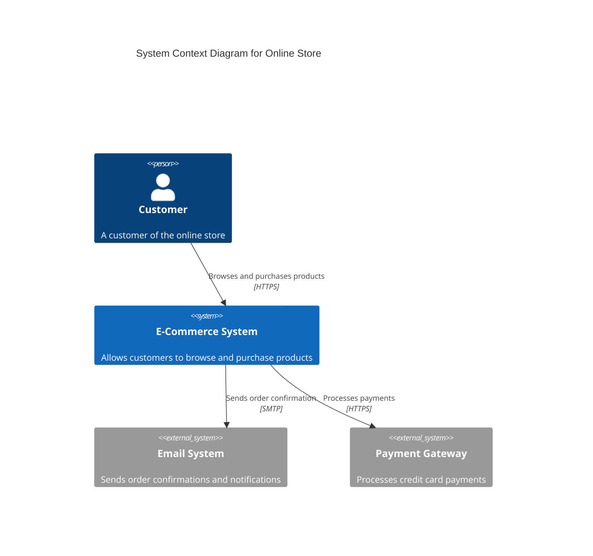
```mermaid
C4Context
    title System Context Diagram for Online Store

    Person(customer, "Customer", "A customer of the online store")
    System(ecommerce, "E-Commerce System", "Allows customers to browse and purchase products")
    System_Ext(email, "Email System", "Sends order confirmations and notifications")
    System_Ext(payment, "Payment Gateway", "Processes credit card payments")

    Rel(customer, ecommerce, "Browses and purchases products", "HTTPS")
    Rel(ecommerce, email, "Sends order confirmation", "SMTP")
    Rel(ecommerce, payment, "Processes payments", "HTTPS")
```

---

# 13. Mindmap

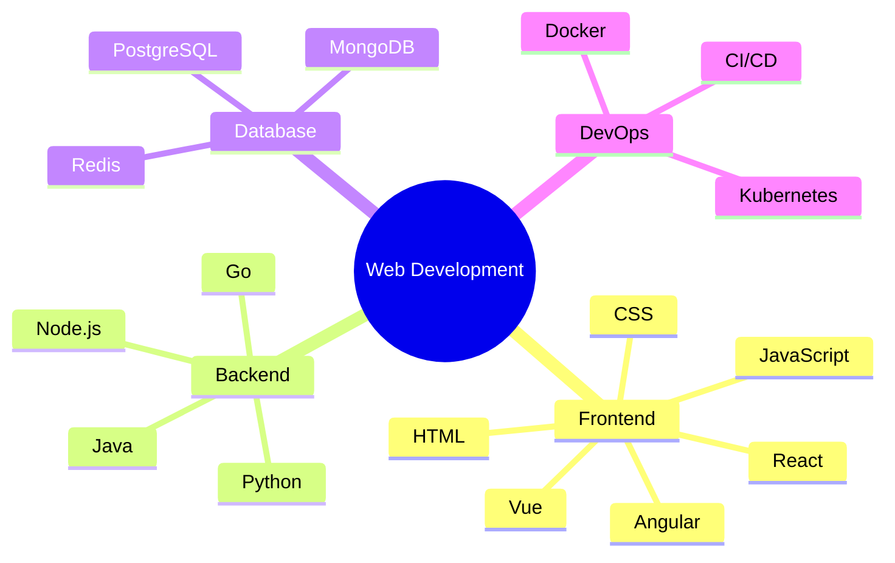
```mermaid
mindmap
  root((Web Development))
    Frontend
      HTML
      CSS
      JavaScript
      React
      Vue
      Angular
    Backend
      Node.js
      Python
      Java
      Go
    Database
      PostgreSQL
      MongoDB
      Redis
    DevOps
      Docker
      Kubernetes
      CI/CD
```

---

# 14. Timeline

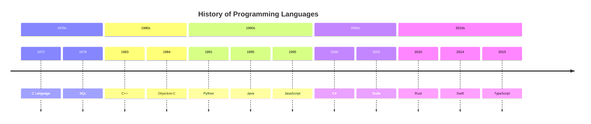
```mermaid
timeline
    title History of Programming Languages
    section 1970s
        1972 : C Language
        1978 : SQL
    section 1980s
        1983 : C++
        1984 : Objective-C
    section 1990s
        1991 : Python
        1995 : Java
        1995 : JavaScript
    section 2000s
        2000 : C#
        2003 : Scala
    section 2010s
        2010 : Rust
        2014 : Swift
        2015 : TypeScript
```

---

# 15. ZenUML

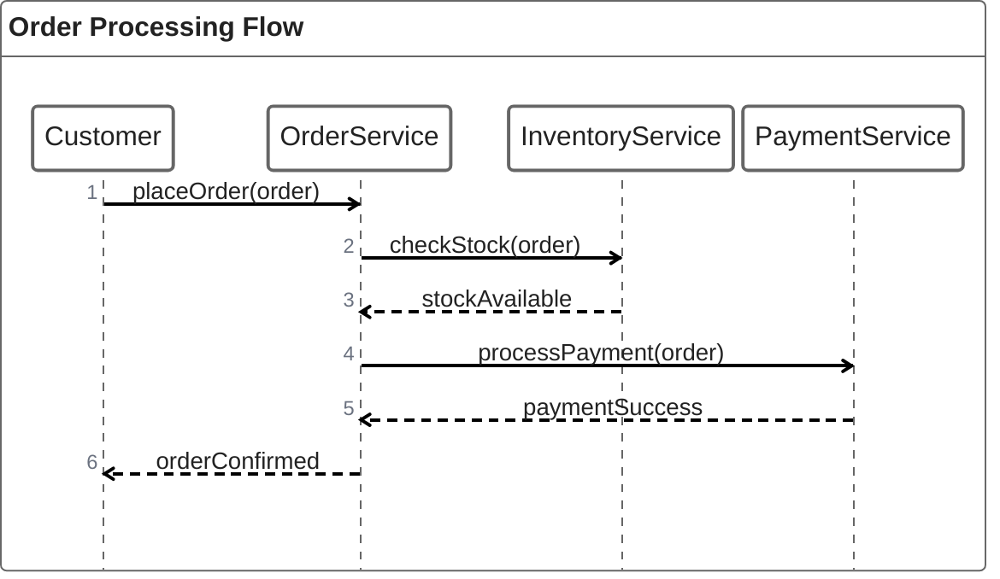
```mermaid
zenuml
    title Order Processing Flow

    Customer -> OrderService: placeOrder(order)
    OrderService -> InventoryService: checkStock(order)
    InventoryService --> OrderService: stockAvailable
    OrderService -> PaymentService: processPayment(order)
    PaymentService --> OrderService: paymentSuccess
    OrderService --> Customer: orderConfirmed
```

---

# 16. Sankey Diagram

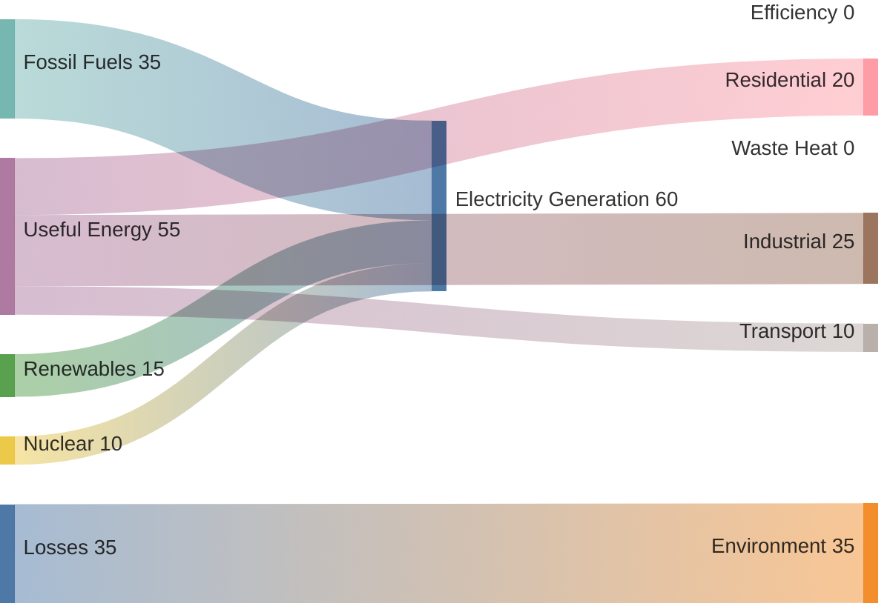
```mermaid
sankey-beta
Electricity Generation,Efficiency,Useful Energy
Electricity Generation,Waste Heat,Losses
Fossil Fuels,Electricity Generation,35
Renewables,Electricity Generation,15
Nuclear,Electricity Generation,10
Useful Energy,Residential,20
Useful Energy,Industrial,25
Useful Energy,Transport,10
Losses,Environment,35
```

---

# 17. XY Chart

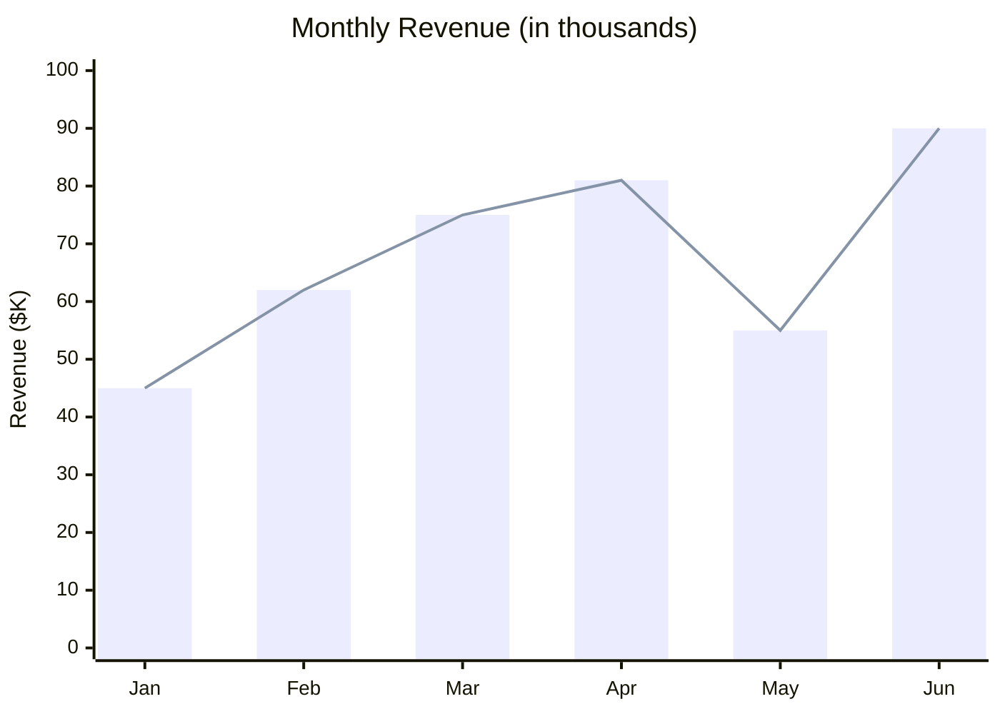
```mermaid
xychart-beta
    title "Monthly Revenue (in thousands)"
    x-axis [Jan, Feb, Mar, Apr, May, Jun]
    y-axis "Revenue ($K)" 0 --> 100
    bar [45, 62, 75, 81, 55, 90]
    line [45, 62, 75, 81, 55, 90]
```

---

# 18. Block Diagram

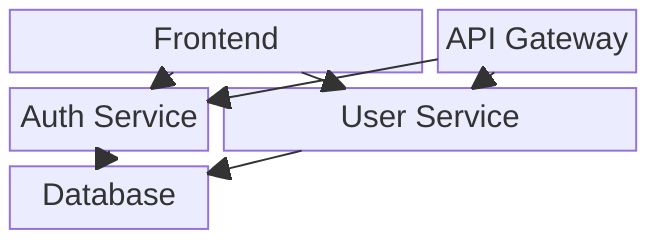
```mermaid
block-beta
    columns 3
    a["Frontend"]:2
    b["API Gateway"]
    c["Auth Service"]
    d["User Service"]:2
    e["Database"]
    
    a --> c
    a --> d
    b --> c
    b --> d
    c --> e
    d --> e
```

---

# 19. Packet Diagram

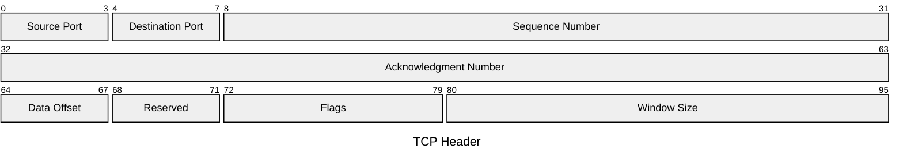
```mermaid
packet
    title TCP Header
    0-3: "Source Port"
    4-7: "Destination Port"
    8-31: "Sequence Number"
    32-63: "Acknowledgment Number"
    64-67: "Data Offset"
    68-71: "Reserved"
    72-79: "Flags"
    80-95: "Window Size"
```

---

# 20. Kanban Diagram

```mermaid
kanban
    id1[Todo]
        id2[Design database schema]
        id3[Create API endpoints]
        id4[Write unit tests]
    id5[In Progress]
        id6[Implement authentication]
        id7[Build frontend components]
    id8[Review]
        id9[Code review: user module]
    id10[Done]
        id11[Setup project repository]
        id12[Configure CI/CD pipeline]
```

---

# 21. Architecture Diagram

```mermaid
architecture-beta
    group api(cloud)[API]

    service db(database)[Database] in api
    service server(server)[Server] in api
    service disk(disk)[Storage] in api
    service internet(internet)[Internet]

    db:L -- R:server
    server:B -- T:disk
    internet:B -- T:server
```

---

# 22. Radar Diagram

```mermaid
radar-beta
    title Developer Skills Assessment
    axis Frontend, Backend, DevOps, Database, Testing
    curve Current {8, 7, 5, 6, 7}
    curve Target {9, 8, 8, 8, 9}
    showLegend true
```

---

# 23. Event Modeling Diagram

```mermaid
eventmodeling
tf 01 ui CartUI
tf 02 cmd AddItem
tf 03 evt ItemAdded
tf 04 rmo CartView
tf 05 ui CartUI
tf 06 cmd RemoveItem
tf 07 evt ItemRemoved
```

---

# 24. Treemap Diagram

```mermaid
treemap-beta
    "Project Budget"
        "Development"
            "Frontend": 30
            "Backend": 40
            "Mobile": 20
        "Operations"
            "DevOps": 15
            "Monitoring": 10
        "Design"
            "UI/UX": 25
            "Research": 10
```

---

# 25. Venn Diagram

```mermaid
venn-beta
    set A["JavaScript"]
    set B["Python"]
    set C["Go"]
    union A,B["Full Stack"]
    union A,C["Systems"]
    union B,C["Data Science"]
```

---

# 26. Ishikawa Diagram (Fishbone)

```mermaid
ishikawa-beta
    Low Code Quality
    Requirements
        Unclear requirements
        Changing specs
    Process
        No code review
        No testing standards
    People
        Lack of training
        High turnover
    Tools
        Outdated IDE
        Missing linters
    Environment
        Slow CI pipeline
        No staging server
```

---

# 27. Wardley Map

```mermaid
wardley-beta
    title Online Store Strategy

    anchor User [0.9, 0.95]
    component "Web Application" [0.7, 0.7]
    component "API" [0.5, 0.6]
    component "Database" [0.3, 0.5]
    component "Hosting" [0.2, 0.4]
    component "CDN" [0.4, 0.8]
    component "Payment Gateway" [0.6, 0.7]

    User -> "Web Application"
    "Web Application" -> "API"
    "API" -> "Database"
    "Web Application" -> "CDN"
    "API" -> "Payment Gateway"
    "Web Application" -> "Hosting"
```

---

# 28. TreeView Diagram

```mermaid
treeView-beta
    "src/"
        "components/"
            "Header.tsx"
            "Footer.tsx"
            "Sidebar.tsx"
        "pages/"
            "Home.tsx"
            "About.tsx"
            "Contact.tsx"
        "utils/"
            "helpers.ts"
            "api.ts"
        "App.tsx"
        "index.tsx"
    "public/"
        "index.html"
        "favicon.ico"
    "package.json"
    "tsconfig.json"
    "README.md"
```

---

# Summary

| # | Diagram Type | Keyword |
|---|---|---|
| 1 | Flowchart | `flowchart` / `graph` |
| 2 | Sequence Diagram | `sequenceDiagram` |
| 3 | Class Diagram | `classDiagram` |
| 4 | State Diagram | `stateDiagram-v2` |
| 5 | Entity Relationship | `erDiagram` |
| 6 | User Journey | `journey` |
| 7 | Gantt Chart | `gantt` |
| 8 | Pie Chart | `pie` |
| 9 | Quadrant Chart | `quadrantChart` |
| 10 | Requirement Diagram | `requirementDiagram` |
| 11 | GitGraph | `gitGraph` |
| 12 | C4 Diagram | `C4Context` / `C4Container` / `C4Component` |
| 13 | Mindmap | `mindmap` |
| 14 | Timeline | `timeline` |
| 15 | ZenUML | `zenuml` |
| 16 | Sankey Diagram | `sankey-beta` |
| 17 | XY Chart | `xychart-beta` |
| 18 | Block Diagram | `block-beta` |
| 19 | Packet Diagram | `packet` |
| 20 | Kanban | `kanban` |
| 21 | Architecture | `architecture-beta` |
| 22 | Radar Chart | `radar-beta` |
| 23 | Event Modeling | `eventmodeling` |
| 24 | Treemap | `treemap-beta` |
| 25 | Venn Diagram | `venn-beta` |
| 26 | Ishikawa (Fishbone) | `ishikawa-beta` |
| 27 | Wardley Map | `wardley-beta` |
| 28 | TreeView | `treeView-beta` |
