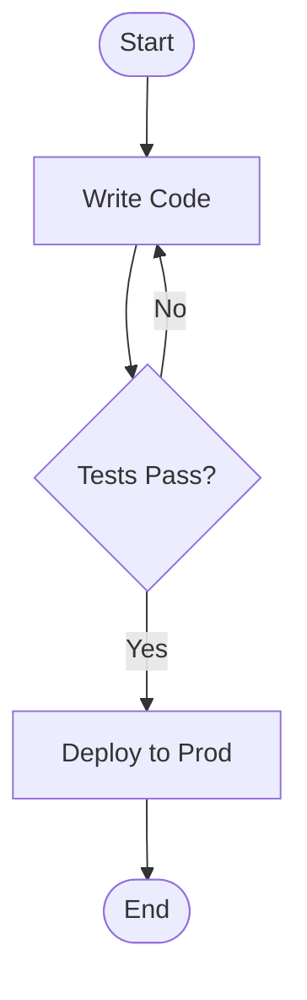
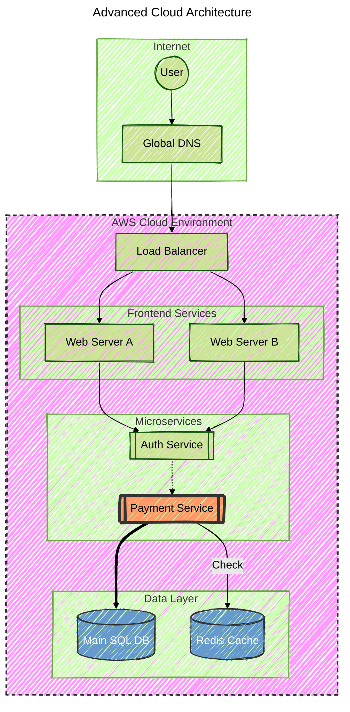

<https://github.com/mermaid-js/mermaid>

# example1

```mermaid
flowchart TD
    Start([Start]) --> Process1[Write Code]
    Process1 --> Test{Tests Pass?}
    Test -- Yes --> Deploy[Deploy to Prod]
    Test -- No --> Process1
    Deploy --> End([End])
```

# example2

```mermaid
---
title: Advanced Cloud Architecture
config:
  theme: forest
  look: handDrawn
---
flowchart TB
    %% Styling Classes
    classDef cloud stroke:#333,stroke-width:2px,fill:#f9f,stroke-dasharray: 5 5
    classDef database fill:#69c,stroke:#333,color:#fff
    classDef critical fill:#f96,stroke:#333,stroke-width:4px

    subgraph Internet
        User((User))
        DNS[Global DNS]
    end

    subgraph AWS_Cloud ["AWS Cloud Environment"]
        LB[Load Balancer]
        
        subgraph Web_Tier ["Frontend Services"]
            direction LR
            Web1[Web Server A]
            Web2[Web Server B]
        end

        subgraph App_Tier ["Microservices"]
            Auth[[Auth Service]]
            Payment[[Payment Service]]
        end

        subgraph Data_Storage ["Data Layer"]
            SQL[(Main SQL DB)]
            Cache[(Redis Cache)]
        end
    end

    %% Connections
    User --> DNS
    DNS --> LB
    LB --> Web1 & Web2
    Web1 & Web2 --> Auth
    Auth -.-> Payment
    Payment ==> SQL
    Payment -- "Check" --> Cache

    %% Apply Classes
    class AWS_Cloud cloud
    class SQL,Cache database
    class Payment critical
```
